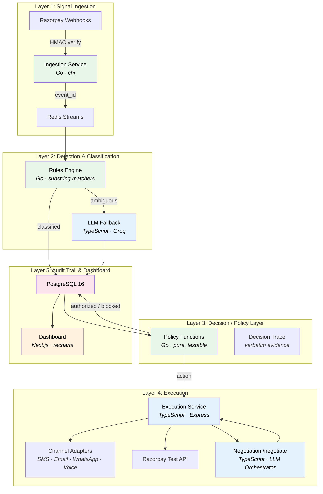

# System Architecture — AI Revenue Recovery

## 5-Layer Architecture



**Color key:** Green = Go services (correctness-critical), Blue = TypeScript (LLM/UI-fast), Orange = Dashboard, Pink = Database

## Data Flow

```
events → classifications → decisions → actions
  ↑          ↑                ↑           ↑
  |          |                |           |
Ingest    Classify         Decide      Execute
(Go)      (Go+TS)         (Go)        (TS)
```

Every layer writes exactly one row per event. The chain is the audit trail — queryable, filterable, and visible in the dashboard's Audit Log with expandable reasoning traces.

## Why Go + TypeScript

**Go** for layers where correctness is non-negotiable: webhook ingestion (HMAC verification), classification (closed-enum enforcement), and the policy layer (guardrails that stop an agent from moving money). Go's explicit error handling and strong type system make the guardrails testable and auditable.

**TypeScript** for layers where iteration speed and LLM integration matter more: execution adapters, message drafting, negotiation conversations, and the dashboard. The LLM Orchestrator's `/draft` and `/negotiate` endpoints use Groq (free tier) with zod-validated structured output and heuristic fallbacks — tight input, tight output, never in the authorization path.
